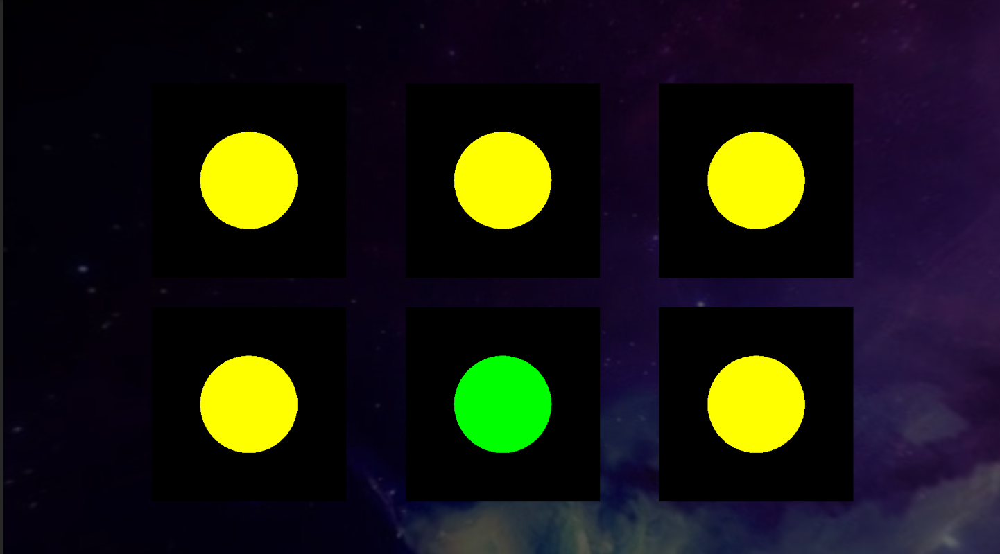

# UnityShapes
GPU-instance-supported, 0 allocation shapes (circle) with one line of code in Unity




Couldn't´t be simpler:

```c#
Circle.Draw(new CircleInfo{
				center = transform.position,
				forward = transform.forward,
				radius = 1f,
				fillColor = Color.Red
			});
```


```c#
public struct CircleInfo
{
  public float radius;
  public Vector3 center;
  public Vector3 forward;
  public Color fillColor;
}
```

